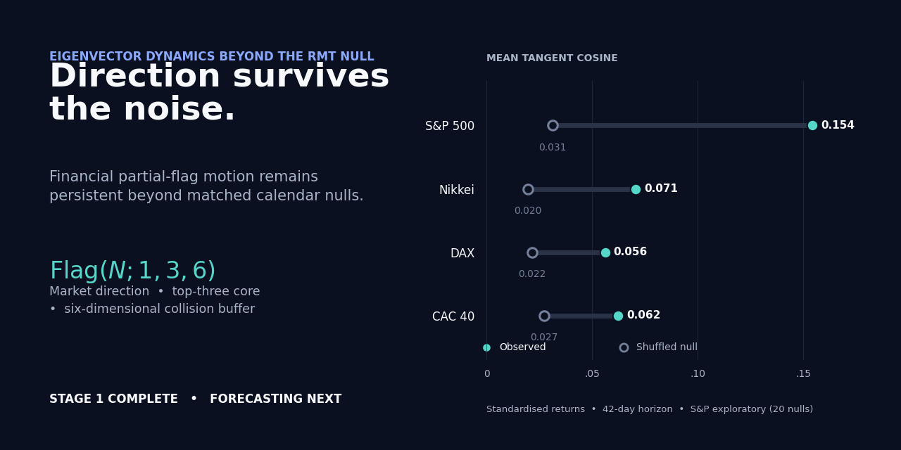

# Eigenvector Dynamics Beyond the RMT Null

Do the dominant eigenspaces of covariance matrices genuinely evolve, or does
finite-window estimation make a static system merely appear to rotate?

This project builds and calibrates an eigenvector-overlap instrument against a
random-matrix null, reproduces published real-market measurements, and then asks
the question that actually matters for risk: **how much of next quarter's
realised cross-sectional variance does a six-factor model span, and is the
missing part forecastable?**



## The headline

A six-factor risk model does not span half of the S&P 500's next-quarter
cross-sectional risk. Choosing its six directions with **perfect hindsight**, it
still misses 39%. The forecastable part of that blindness is worth roughly 1% of
residual volatility, and a one-parameter exponential kernel already collects
essentially all of it.

The final experiment establishes why that ceiling is not a modelling failure.
The score is linear in the rank-6 projector, so a symmetric correction to any
estimator can move it **only** through the off-diagonal block
$U_\perp^\top G\,U_6$. A five-parameter model aimed directly at that block, fitted
four different ways, does not beat the EWMA it contains on any of four markets.
The objective is flat.

## Results

### Realised-variance capture, four markets

Estimation window $T_{\rm in}=750$, disjoint target window $T_{\rm out}=42$, step 14.
Test origins only; EWMA half-life selected on validation. Intervals are
circular-block bootstrap at 57-origin blocks (~2 independent blocks per panel).

| Panel | $N$ | random $6/N$ | Frozen | in-sample ceiling | ceiling bias | **real headroom** |
|---|---:|---:|---:|---:|---:|---:|
| CAC 40 | 23 | 0.261 | 0.618 | 0.784 | 0.078 | **0.088** |
| DAX | 29 | 0.207 | 0.579 | 0.749 | 0.083 | **0.087** |
| Nikkei | 131 | 0.046 | 0.473 | 0.647 | 0.089 | **0.086** |
| S&P 500 | 357 | 0.017 | 0.442 | 0.614 | 0.078 | **0.093** |

The in-sample ceiling is not free. Simulating the target window from the
estimation covariance itself — a world where the subspace does not move, so
honest headroom is exactly zero — still reports 0.078–0.089 of headroom at
$T_{\rm out}=42$. That is pure overfitting of a 42-observation realisation and is
subtracted before any skill is quoted. **Real headroom is 0.086–0.093 while $N$
runs 23 → 357**, a 16-fold change in dimension.

### What the ladder actually collects

| Panel | best EWMA | vs Frozen | 95% CI | excludes zero | share of real headroom |
|---|---|---:|---|:--:|---:|
| CAC 40 | hl=126 | +0.0043 | [−0.0041, +0.0126] | no | 4.9% |
| DAX | hl=252 | +0.0082 | [+0.0058, +0.0109] | yes | 9.5% |
| Nikkei | hl=252 | +0.0081 | [+0.0065, +0.0098] | yes | 9.5% |
| S&P 500 | hl=126 | +0.0145 | [+0.0115, +0.0175] | yes | 15.6% |

An earlier pooled reading gave 24 significantly-positive cells out of 24. Redone
split-clean with dependence-aware intervals, the sign pattern survives on all four
panels and the effect is *larger* than the pooled estimate — but CAC loses
significance once its origins are correctly counted as ~2 independent blocks.

### The rotationally-invariant class is pinned at zero by construction

| Panel | Ledoit–Wolf | OAS | QIS | EWMA hl=252 |
|---|---:|---:|---:|---:|
| CAC 40 | +0.0000 | +0.0000 | −0.0002 | +0.0042 |
| DAX | +0.0000 | +0.0000 | −0.0001 | +0.0082 |
| Nikkei | −0.0000 | −0.0000 | −0.0008 | +0.0081 |
| S&P 500 | +0.0000 | +0.0000 | −0.0011 | +0.0138 |

Not a coincidence and not a bug. Every rotationally-invariant estimator is an
eigenvalue map with the sample eigenvectors held fixed, so its visible block
vanishes identically and it cannot move a subspace metric. The repository
**tests** this predicate rather than inferring it from matching decimals: the
shrinkage step has visible block $\sim10^{-16}$ on every sampled origin.

QIS's residual is the pipeline, not QIS — renormalising an estimate to a
correlation matrix is a congruence $D^{-1/2}SD^{-1/2}$, not a similarity, and it
preserves eigenvectors only when $D$ is scalar. LW and OAS keep a constant
diagonal and pass through untouched; QIS does not.

**The covariance-cleaning literature has not tried and failed to forecast
correlation geometry. The question is structurally outside its frame.**

### Model 4.1 — solving the first-order problem exactly

$$\hat M_t=\hat C_t(\theta)+\varepsilon\sum_{m=1}^{3}\beta_m\Big(U_\perp A^{(m)}_tU_6^\top+U_6A^{(m)\top}_tU_\perp^\top\Big)$$

Five parameters, every one acting on the only block the metric can see. Nests
Frozen, every EWMA and constant-velocity momentum exactly.

| Panel | $\theta$ | $\varepsilon$ | validation gate | passed | **test vs EWMA** | 95% CI |
|---|---:|---:|---:|:--:|---:|---|
| CAC 40 | 252 | 0.020 | +0.0004 | yes | **−0.0002** | [−0.0018, +0.0013] |
| DAX | ∞ | 0.200 | +0.0010 | yes | **−0.0029** | [−0.0046, −0.0014] |
| Nikkei | 252 | **0.000** | 0.0000 | no | 0.0000 | — |
| S&P 500 | 252 | 0.100 | +0.0001 | yes | **−0.0001** | [−0.0002, +0.0000] |

The stopping rule was predeclared, applied verbatim, and no re-tuning followed.
Nikkei's validation step chose $\varepsilon=0$: given a free amplitude, the data
switched the correction off. DAX is significantly *worse* than the EWMA it
contains.

### Optimising the risk is not optimising the geometry

Forecasting *where the subspace goes* and maximising *how much realised variance
it spans* are different objectives — they coincide only if realised variance were
isotropic across the complement. Four losses, identical parameter counts:

| Panel | cos(geometry, risk) | cos(exact, risk) | spread in validation capture |
|---|---:|---:|---:|
| CAC 40 | **−0.16** | +0.92 | 0.00458 → 0.00493 |
| DAX | +0.77 | +1.00 | 0.00233 → 0.00256 |
| Nikkei | +0.87 | +0.99 | all 0.00338 |
| S&P 500 | +0.97 | +1.00 | 0.00201 → 0.00209 |

The distinction is real and dimension-dependent — on the smallest panel the two
losses pick nearly opposed directions. But every loss scores within
$4\times10^{-4}$ capture of every other. **The objective is flat in $\beta$**,
which is a stronger negative than the headroom argument: the failure is not the
choice of loss or of features.

## Reproduce

```bash
pip install -r requirements.txt
python -m pytest -q                 # numerical, statistical and invariance tests
python run_model4_1.py              # capture ladder + Model 4.1, all four panels
python run_model4_1.py --quick      # skips the exact-capture sphere search
```

`run_model4_1.py` runs tests first and refuses to continue if the coupling
algebra fails, then regenerates the ladder and Model 4.1 per panel into
`results/stage2/`. Expect roughly 15–40 minutes for the full four-panel run;
S&P 500 dominates.

Individual stages:

```bash
python scripts/stage2_capture_ladder.py --label sp500_full
python scripts/stage2_model4_1_visible_coupling.py --label dax_full
python run_alarms.py                # Stage 1 self-audit suite
```

## Repository structure

| Path | Purpose |
|---|---|
| [`BUILDNOTES.md`](BUILDNOTES.md) | chronological notebook: what was tested, the setup, and what happened |
| [`PRIOR_ART.md`](PRIOR_ART.md) | literature review and the novelty boundary |
| [`stage1/README.md`](stage1/README.md) | complete Stage 1 argument and results |
| [`stage2/README.md`](stage2/README.md) | forecasting targets, baselines and evaluation plan |
| [`src/capture.py`](src/capture.py) | the respecified score, Haar floor and stationary ceiling null |
| [`src/coupling.py`](src/coupling.py) | visible-block algebra, features and the four $\beta$ estimators |
| [`src/capture_ladder.py`](src/capture_ladder.py) | origin construction, leak-free scaling, split assignment, block bootstrap |
| [`src/`](src) | RMT, data, Grassmann/flag geometry, ERSE and covariance benchmarks |
| [`scripts/`](scripts) | reproducible experiment runners |
| [`tests/`](tests) | numerical, statistical and invariance tests |
| `data/`, `results/` | cached inputs; generated tables, nulls and figures |

## Method notes worth knowing

**Three parameters, never conflated.** $T_{\rm in}=750$ is chosen for
conditioning, $T_{\rm out}=42$ for economic relevance and *is* the horizon, and
step is 14. Estimation and target windows are disjoint by construction, so
deletion contamination is impossible rather than corrected.

**The realised block is standardised by estimation-window quantities only.**
This is the easiest place in the design to leak the future, so the scaling is
written out explicitly instead of delegated to a helper whose global mean divisor
would silently read the target window.

**Splits are assigned by target date, and the purge is checked.** The first
validation target window must open strictly after the last training target
closes; splitting on origin date instead would let a training target overlap a
validation estimation window.

**Intervals are circular-block, not t-statistics.** Overlapping rolling windows
are not independent origins. At 57-origin blocks each panel carries about two
independent blocks over its test period, and quoted intervals reflect that.

## Status

Stage 1 and Stage 2 are complete. The instrument is calibrated, the artifact that
dominated the original leaderboard is gone, the metric is live, and the
forecasting question has a documented negative answer with a predeclared stopping
rule that was honoured. For the full record start with
[`BUILDNOTES.md`](BUILDNOTES.md); for the polished Stage 1 argument read
[`stage1/README.md`](stage1/README.md).
