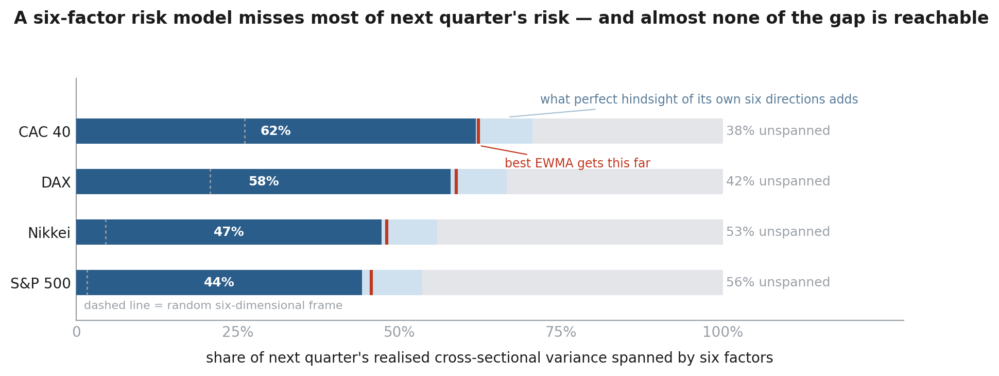
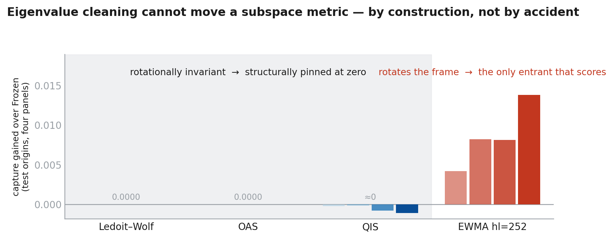
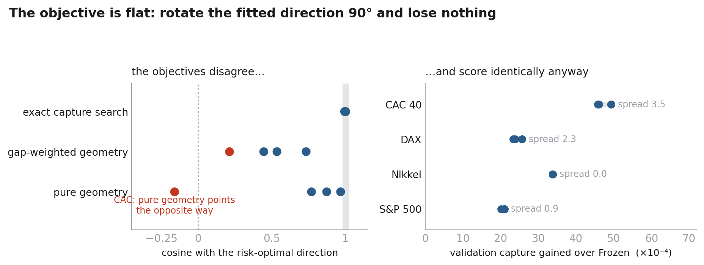

# Eigenvector Dynamics Beyond the RMT Null

**Do covariance eigenspaces genuinely rotate, or does finite-window estimation
just make a static system look like it does?**

Stage 1 builds an instrument that measures rotation against a random-matrix
null. Stage 2 asks the question that matters for risk: how much of next
quarter's realised cross-sectional variance does a six-factor model span, and is
the missing part forecastable?

Four equity markets, 23 → 357 names, disjoint 750-day estimation and 42-day
target windows, split-clean throughout.

---

## 1. Six factors miss most of next quarter's risk



Frozen spans 44% of the S&P 500's next-quarter realised variance. Give it
**perfect hindsight of its own six directions** and it still misses 39%.

The pale band is real headroom, and getting it required subtracting a null most
people skip: simulate the target window from the estimation covariance itself —
a world where the subspace provably does not move — and the in-sample ceiling
*still* reports 0.078–0.089 of headroom at $T_{\rm out}=42$. That is pure
overfitting of a 42-observation realisation, and it is roughly half the naive
gap. **Real headroom is 0.086–0.093 while $N$ varies 16-fold.**

## 2. Eigenvalue cleaning cannot move a subspace metric



Ledoit–Wolf, OAS and QIS score $0.0000$ against Frozen. Not "small" — pinned, by
construction.

The score is linear in the rank-6 projector, so a symmetric correction $G$ moves
it **only** through the off-diagonal block $U_\perp^\top G\,U_6$. Every
rotationally-invariant estimator is an eigenvalue map with the sample
eigenvectors held fixed, so that block is identically zero. The repository
*tests* this predicate rather than inferring it from matching decimals: measured
visible block $\sim10^{-16}$ on every sampled origin.

> The covariance-cleaning literature has not tried and failed to forecast
> correlation geometry. The question is structurally outside its frame.

*(QIS's residual $-0.0011$ is the pipeline, not QIS: renormalising to a
correlation matrix is a congruence $D^{-1/2}SD^{-1/2}$, which preserves
eigenvectors only when $D$ is scalar. LW and OAS keep a constant diagonal and
pass through untouched.)*

## 3. The negative result: the objective is flat



Model 4.1 spends five parameters entirely inside that visible block — the only
place the metric can see. It nests Frozen and every EWMA exactly. It was fitted
four ways: maximise realised risk, predict the geometry, predict the geometry
ignoring the eigengap, and search the sphere for the exact optimum.

The four losses pick genuinely different directions — on CAC, pure geometry
points at cosine **−0.16** to the risk-optimal direction. **And they all score
within $4\times10^{-4}$ capture of each other.**

Against a predeclared stopping rule, applied verbatim with no re-tuning:

| | CAC 40 | DAX | Nikkei | S&P 500 |
|---|---:|---:|---:|---:|
| **test vs EWMA** | −0.0002 | **−0.0029** | 0.0000 | −0.0001 |

Zero of four panels beat the EWMA the model contains. Nikkei's validation step
chose $\varepsilon = 0$ — offered a free amplitude, the data switched the
correction off. DAX is significantly *worse* than its own baseline.

That is a stronger negative than a headroom argument: the failure is not the
loss, not the features, and not the model class. There is no direction in this
space the metric appreciably rewards.

---

## Run it

```bash
pip install -r requirements.txt
python -m pytest -q            # 180 tests
python run_model4_1.py         # ladder + Model 4.1, four panels (~15–40 min)
```

`run_model4_1.py` runs the tests first and refuses to continue if the coupling
algebra fails. Add `--quick` to skip the exact-capture sphere search.

## Map

| Path | |
|---|---|
| [`BUILDNOTES.md`](BUILDNOTES.md) | chronological record — what was tested, and what happened |
| [`PRIOR_ART.md`](PRIOR_ART.md) | literature review and the novelty boundary |
| [`stage1/README.md`](stage1/README.md) | the full Stage 1 argument |
| [`src/coupling.py`](src/coupling.py) | visible-block algebra, features, four $\beta$ estimators |
| [`src/capture.py`](src/capture.py) | the score, Haar floor, stationary ceiling null |
| [`src/capture_ladder.py`](src/capture_ladder.py) | origins, leak-free scaling, splits, block bootstrap |
| [`scripts/`](scripts) · [`tests/`](tests) · `results/` | runners, tests, generated tables |

## Three design notes

**Estimation and target windows are disjoint**, so deletion contamination is
impossible rather than corrected. $T_{\rm in}=750$ is chosen for conditioning,
$T_{\rm out}=42$ for economic relevance and *is* the horizon.

**The realised block is scaled by estimation-window quantities only** — written
out explicitly rather than delegated to a helper whose global mean divisor would
silently read the target window.

**Intervals are circular-block, not t-statistics.** Overlapping rolling windows
are not independent origins; at 57-origin blocks each panel carries about two.
Redoing the earlier pooled ladder this way kept the sign pattern on all four
panels but cost CAC its significance.
